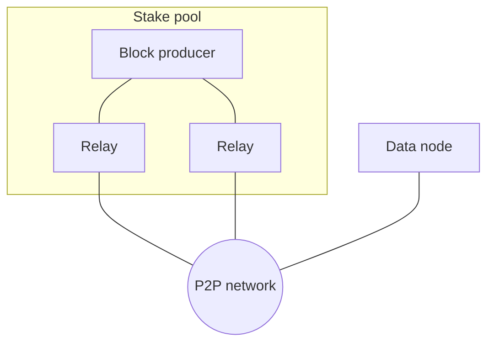

# Peer Selection

The Cardano node receives chain updates from upstream peers and forwards chain
updates to downstream peers. While the downstream behaviour can only be switched
on or off (by accepting connections or not), the upstream behaviour depends on
actively establishing connections to other peers. There are two basic ways in
which this is configured:

- a static configuration lists known peers by IP address and port or by a DNS name,
  which either has an SRV record as per [CIP-0155](https://cips.cardano.org/cip/CIP-0155)
  or is accompanied by a port
- a dynamic configuration states how many peers to connect to, with peers being
  discovered either through the ledger or through the
  [peer sharing](../network/node-to-node/peer-sharing) protocol.

> [!WARNING]
> This section is far from complete, below is an evolving sketch of its future
> contents

## Safety considerations

In general, a Cardano node with fully dynamic peer selection may be exposed to
eclipse attacks (being nudged by malicious peers into connecting only to
malicious peers); an attacker with sufficient control over the infrastructure can
also route statically selected peers to its own nodes (by forging DNS or routing
information). A solution to this problem while syncing has been formulated in the
[Ouroboros Genesis paper](https://iohk.io/en/research/library/papers/ouroboros-genesis-composable-proof-of-stake-blockchains-with-dynamic-availability/).

A statically configured node can avoid these issues by having a fixed connection
to at least one known honest peer (which assumes a non-adversarial network,
usually including an honest DNS; for these reasons it may not actually solve the
problem).

## Common setups

A block producer run by a diligent stake pool operator will have a completely
static configuration that connects it to its designated relay nodes only.
Relay nodes typically supplement dynamic selection with some static
configuration that at least sets up the connections to their respective block
producer. Data nodes may choose any combination of static and dynamic
configuration.

Inside the pool the links are static: the producer talks only to its
relays, and each relay keeps a static path back to the producer.
Relays (and any data node that opts in) also select peers dynamically
from the ledger, [PeerSharing](../network/node-to-node/peer-sharing),
and inbound sessions. See
[Peer management](../network/peer-management.md).

## Dynamic peer selection process

At a roughly hourly schedule, the node should replace the bottom 20% of its
peers with randomly selected new ones. The interval should be randomized to
avoid the whole network synchronizing on this schedule, which would impair
performance at this time. The ranking for determining which nodes to replace
should be linked to honesty chain update performance: the first peer to
announce a correct and new block should be rewarded. It may be that rewarding
the second and third makes sense as well, although that is not currently done
by the Haskell implementation.

Before choosing the above strategy the expected outcomes on a whole network
level have been simulated. The churn rate of 20% per hour has been selected
based on those outcomes ([Santos 2023][p2p-eng]; possible Close-Random and
header-first scoring policies are [CougaR][cougar] and
[SCRamble][scramble]), the Haskell implementation uses [custom metrics][metrics].
In private discussions, the IOG network working
group has indicated that 40%/h might lead to the network falling apart
into multiple disconnected pieces. That possibility is not in the
published simulations. This note is left here as a cautionary tale that
changing this strategy will require stringent analysis.

[cougar]: https://doi.org/10.1145/3524860.3539805
[p2p-eng]: https://www.essentialcardano.io/article/engineering-dive-into-cardanos-dynamic-p2p-design
[scramble]: https://arxiv.org/abs/2601.10277
[metrics]: https://ouroboros-network.cardano.intersectmbo.org/ouroboros-network/Ouroboros-Network-PeerSelection-PeerMetric.html#g:2
