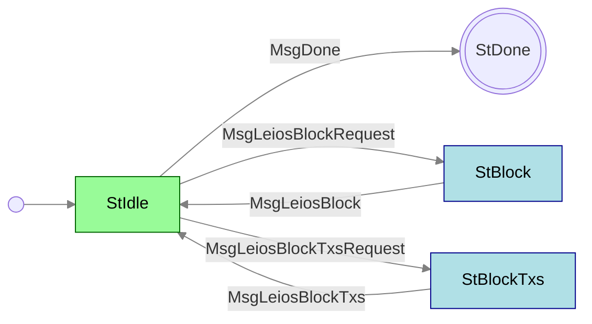

# LeiosFetch

**Mini-protocol number: 19**

`LeiosFetch` is the mini-protocol responsible for fetching Endorser Blocks (EBs)
and their transaction payloads from peers. It is a pull-based protocol: the
client explicitly requests either a full EB or a subset of its transactions
(identified by a bitmap), and the server streams the response.

EBs are discovered via [LeiosNotify](../leios-notify/README.md); once a node
decides it wants a block or its transactions, it uses `LeiosFetch` to retrieve
the data.

## State machine



### State agencies

| State      | Agency                                          |
| :--------- | :---------------------------------------------- |
| StIdle     | <span class="agency-initiator">Initiator</span> |
| StBlock    | <span class="agency-responder">Responder</span> |
| StBlockTxs | <span class="agency-responder">Responder</span> |

### State transitions

| From state | Message                 | Parameters                    | To state   |
| :--------- | :---------------------- | ----------------------------- | :--------- |
| StIdle     | MsgDone                 |                               | End        |
| StIdle     | MsgLeiosBlockRequest    | `point`                       | StBlock    |
| StBlock    | MsgLeiosBlock           | `endorser_block`              | StIdle     |
| StIdle     | MsgLeiosBlockTxsRequest | `point`, `bitmaps`            | StBlockTxs |
| StBlockTxs | MsgLeiosBlockTxs        | `point`, `bitmaps`, `tx_list` | StIdle     |

## Codecs

The messages depicted in the state machine follow this CDDL specification:

```cddl
;; messages.cddl
{{#include messages.cddl}}
```

> [!NOTE]
>
> The `endorser_block`, `bitmaps` and `tx` types remain underspecified
> pending further protocol design, including whether `tx_list` is
> length-definite, and the bitmap-based transaction request
> (`MsgLeiosBlockTxsRequest`) may yet change as the roaring bitmap encoding is
> still under discussion.
>
> Catch-up oriented batch requests were once expected here
> (`MsgLeiosBlockRangeRequest` and its replies). They were never implemented
> and are no longer planned, so they are not specified.
