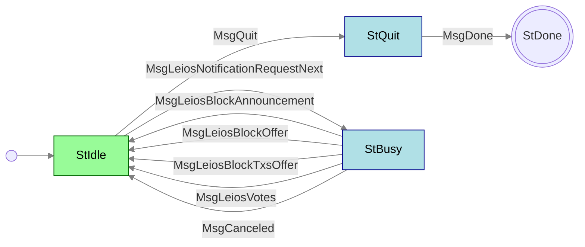

# LeiosNotify

**Mini-protocol number: 18**

`LeiosNotify` is the mini-protocol responsible for announcing Endorser Blocks
(EBs) and offering EB bodies and their associated transaction closures to peers.
It is a pull-based protocol: the client drives progress by requesting the next
notification, and the server replies with whatever is available.

Leios introduces Endorser Blocks as a mechanism to endorse and achieve consensus
on transaction inclusion independently and overlayed on the Praos block chain.
`LeiosNotify` is the dissemination layer that lets peers discover new EBs before
fetching them via [LeiosFetch](../leios-fetch/README.md). The protocol is
intended to run in a pipelined fashion where the client issues multiple
`MsgRequestNext` even before receiving a notification, so that the server can
push announcements to downstream peers with minimal latency.

> [!WARNING]
>
> TODO: Add more detail about admitted pipeline depth and other punishable requirements

## State machine



### Terminating

The client cannot simply stop. It only has agency in `StIdle`, and a request
leaves it in `StBusy` awaiting a reply the server may have no reason to send:
under light load there may be nothing to announce for a long while. A node
being demoted from hot to warm has a bounded time to shut the protocol down
cleanly, and losing that race costs the whole connection rather than just this
mini-protocol.

Two messages resolve that. `MsgCanceled` lets the server answer "nothing for
you" and hand agency back, so the client is never stranded in `StBusy`. And
`MsgQuit` lets the client declare it is leaving without first draining the
replies it has outstanding -- it may be pipelining many requests, and waiting
for each in turn would make shutdown latency a function of pipeline depth. The
server closes with `MsgDone`, so termination is a two-step handshake rather
than a unilateral act by either side.

### State agencies

| State  | Agency                                          |
| :----- | :---------------------------------------------- |
| StIdle | <span class="agency-initiator">Initiator</span> |
| StBusy | <span class="agency-responder">Responder</span> |
| StQuit | <span class="agency-responder">Responder</span> |

### State transitions

| From state | Message                         | Parameters         | To state |
| :--------- | :------------------------------ | ------------------ | :------- |
| StIdle     | MsgQuit                         |                    | StQuit   |
| StQuit     | MsgDone                         |                    | End      |
| StIdle     | MsgLeiosNotificationRequestNext |                    | StBusy   |
| StBusy     | MsgLeiosBlockAnnouncement       | `announcement`     | StIdle   |
| StBusy     | MsgLeiosBlockOffer              | `point`, `eb_size` | StIdle   |
| StBusy     | MsgLeiosBlockTxsOffer           | `point`            | StIdle   |
| StBusy     | MsgLeiosVotes                   | `[1* vote]`        | StIdle   |
| StBusy     | MsgCanceled                     |                    | StIdle   |

## Codecs

The messages depicted in the state machine follow this CDDL specification:

```cddl
;; messages.cddl
{{#include messages.cddl}}
```

> [!NOTE]
>
> The CBOR tags in this specification are provisional. Several types remain underspecified (`any`) pending
> further protocol design. See [CIP-0164](https://github.com/cardano-foundation/CIPs/pull/1167)
> for rationale and ongoing discussion.
